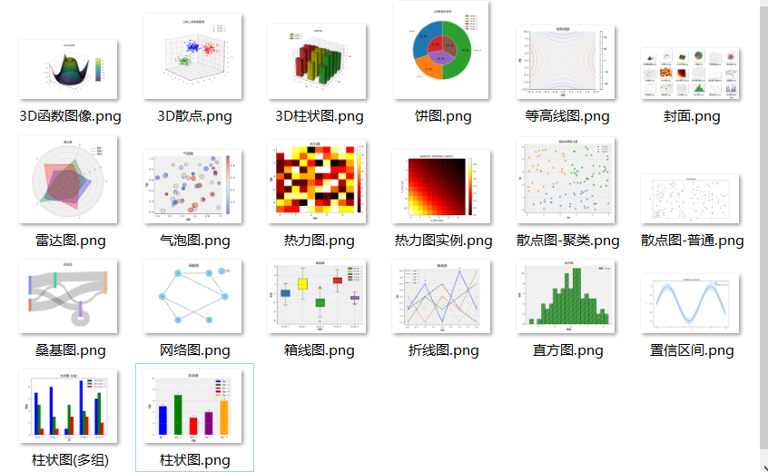

### 常见绘图样式

| 画图种类                     | 图像特点                                           | 图像用途                                             |
| ---------------------------- | -------------------------------------------------- | ---------------------------------------------------- |
| 1. 折线图（Line Plot）       | 连续数据的变化趋势，直线连接数据点                 | 显示数据随时间或其他连续变量的趋势，检测趋势和周期性 |
| 2. 散点图（Scatter Plot）    | 二维数据点的分布，点在二维平面上                   | 观察两个变量之间的关系，检测数据的聚集和离群点       |
| 3. 柱状图（Bar Chart）       | 长方形条形表示数据大小，用于比较不同类别的数据     | 显示离散或分类数据的大小比较，展示排名和分组数据     |
| 4. 直方图（Histogram）       | 数据的分布情况，用矩形条表示数据频率               | 分析数据的分布和形状，检测数据的偏态和峰值           |
| 5. 饼图（Pie Chart）         | 扇形表示数据占比，用于显示分类数据的比例关系       | 展示数据的百分比构成，用于显示相对比例和份额         |
| 6. 箱线图（Box Plot）        | 显示数据的统计分布情况，包括中位数、四分位数等     | 检测数据的离群点和异常值，比较不同组数据的分布       |
| 7. 热力图（Heatmap）         | 二维数据的颜色编码图，用颜色表示数值大小           | 可视化矩阵或二维数组，观察数据的相关性和关联程度     |
| 8. 3D图（3D Plot）           | 三维数据的可视化图像，如散点图、曲面图、柱状图等   | 展示三维数据的关系和分布，可视化空间数据             |
| 9. 等高线图（Contour Plot）  | 二维数据的等高线图，用线表示等高线                 | 可视化函数的等高线，显示函数的高低和形状             |
| 10. 气泡图（Bubble Chart）   | 类似散点图，但点的大小还代表附加数值               | 同时展示两个维度的数据信息，强调第三维度的差异       |
| 11. 雷达图（Radar Chart）    | 多维数据的可视化图像，用多边形表示数据分布         | 显示多个维度数据的相对比较，可视化数据特征和优劣     |
| 12. 网络图（Network Graph）  | 节点和边构成的图形，用于显示关系网络               | 可视化节点和边的关系网络，显示节点的中心性和连接性   |
| 13. 树状图（Tree Diagram）   | 分层结构数据的可视化图像，用于展示层次结构         | 可视化分层结构数据，展示层级关系和层次结构           |
| 14. 桑基图（Sankey Diagram） | 流程和能量转移数据的可视化图像，用箭头表示数据流向 | 显示流程和能量的转移情况，观察数据的流向和转化情况   |

 必备`matlabplot`库。

可自行拓展`plotly`, `seaborn`库。

